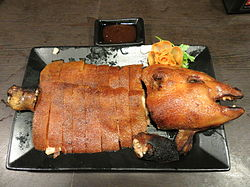

<html>
<head>
<title>圖片練習</title>
</head>
<body>

<a href="2nd.html">燒乳豬</a>
<a href="3rd.html">北京烤鴨</a>
<a href="4th.html">小籠包</a>
<a href="5th.html">心得</a>

<table border="1">
<tr>
<th valign="bottom"><h2>圖片</h2></th>
<th valign="bottom"><h2 valign="middie">標題</h2></th>
<th valign="bottom"><h2 valign="middie">說明</h2></th>
</tr>

<tr>
<td></td>
<td align="center"><h3>[全文分享] 燒乳豬（亦稱烤乳豬）是一種料理，世界不同的飲食文化中都有燒乳豬這種菜色</h3></td>
<td align="center">，而在中國，燒乳豬是廣東傳統食物的一種。 烤燒乳豬的製法是將二至六個星期大，仍未斷奶的乳豬宰殺後，以爐火燒烤而成。 </td>
</tr>

<tr>
<td></td>
<td align="center"><h3>[全文分享] 國名菜，又名北京填鴨，是享譽國際的著名北京料理</h3></td>
<td align="center">，用料為優質肉食鴨北京鴨 ，果木炭火烤製，色澤紅潤，肉質肥而不膩。 </td>
</tr>

<tr>
<td></td>
<td align="center"><h3>[全文分享]小籠饅頭的歷史可上溯自北宋，現在的河南開封為當年的首都汴京，至今仍流行「灌湯包」。</h3></td>
<td align="center">靖康之難後，宋室南渡，將中原的麵食飲食習慣一併帶到南方 ，逐漸本地化發展的小籠包亦因此開始成為江浙一帶的代表性食物 </td>
